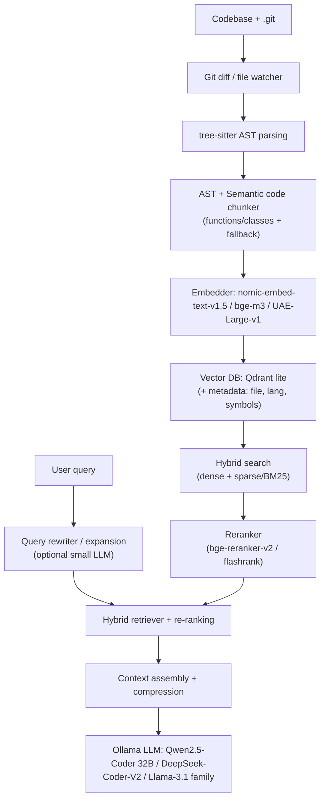

# 🧠 raggy-node
**The lightweight, local-first RAG engine for codebases — AST-native, git-aware, 100% private**

Node.js tool to help you understand and fix your codebase using LLMs.

100% local, no cloud uploads.

> 🚧 **Very early stage — vision & architecture phase** (February 2026)  
> This is **Readme-Driven Development**.  
> **Star ⭐ to follow progress and influence the direction!**

## 📋 Table of Contents
- [The vision](#the-vision)
- [Why it matters](#why-this-project-matters)
- [Planned core features](#planned-core-features)
- [Architecture](#architecture)
- [License](#license)

## The vision
Most RAG tools treat code like plain text — they just slice it into chunks.

**raggy-node** actually understands code structure.

It keeps functions whole, tracks imports, and knows when files change.

So when you ask a question, it finds the right context — not just random snippets.

## Why this project matters
- Commercial code AI tools (Cursor, Cody, Windsurf…) often require cloud access → privacy & cost issues
- Open-source alternatives are mostly Python-heavy or not deeply AST-aware
- JavaScript/TypeScript developers deserve a native, fast, embeddable solution
- Local LLMs (Qwen2.5-Coder, DeepSeek-Coder-V2, Llama-3.1-based…) **retrieval quality**

## Planned core features

| Feature | Purpose | Priority |
|---------|---------|----------|
| **AST-based semantic chunking** | tree-sitter + function/class boundaries | ★★★★★ |
| **Git-aware incremental indexing** | Only re-process changed files | ★★★★★ |
| **Hybrid search** | Dense + BM25 + metadata boosting | ★★★★☆ |
| **Multi-backend vector store** | Qdrant lite (default) / Chroma / LanceDB | ★★★★☆ |
| **Lightweight default mode** | 2–6 GB RAM on consumer laptops | ★★★★☆ |
| **Simple & powerful CLI** | `raggy index`, `raggy ask`, `raggy watch` | ★★★★★ |
| **TypeScript SDK** | Embed into extensions, agents, scripts | ★★★★☆ |
| **Basic code graph** | Import graph + call graph (alpha) | ★★★☆☆ |
| **VS Code extension** | Inline chat / explain / refactor | ★★★☆☆ |

## Architecture

## License
MIT License — feel free to use in commercial projects.
